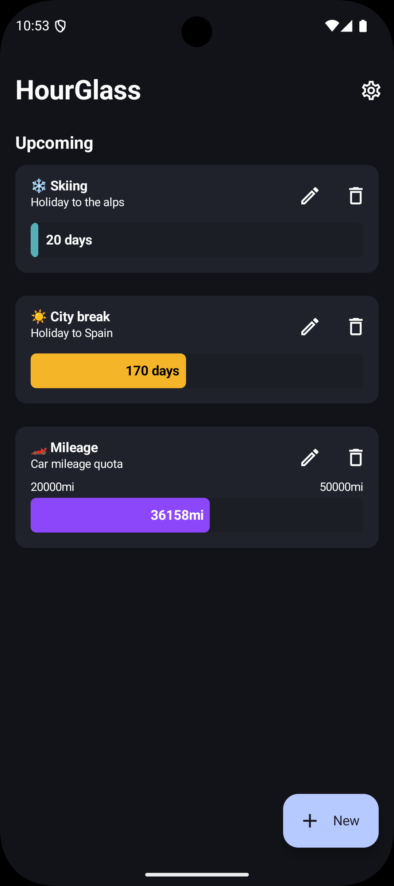
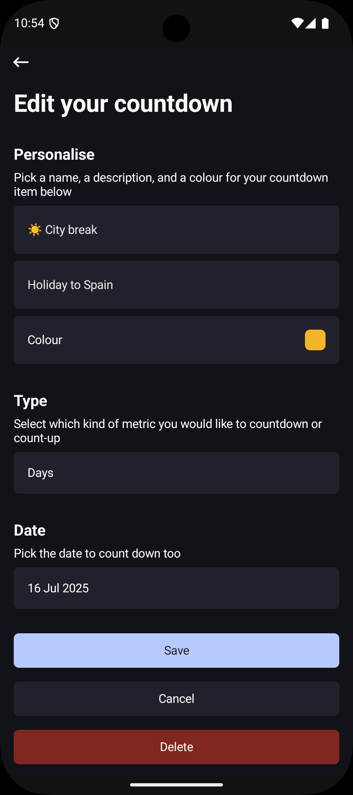
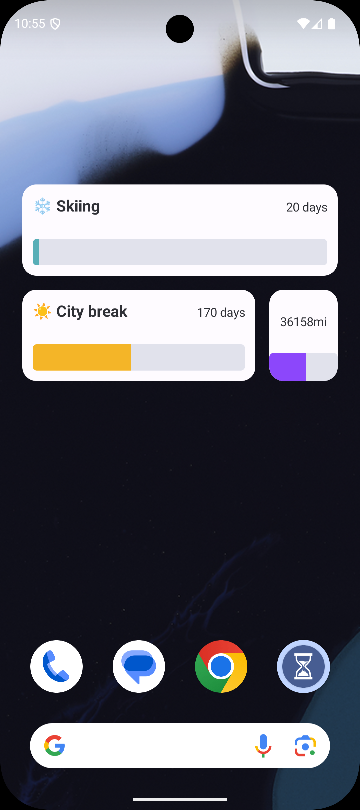
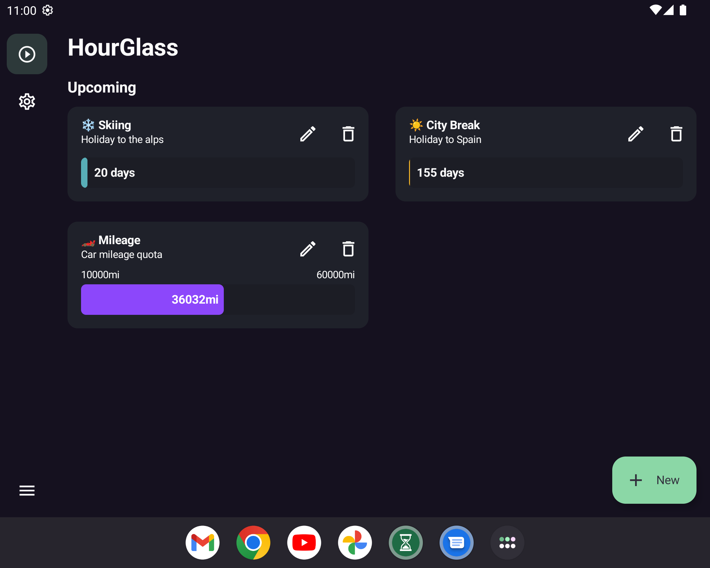
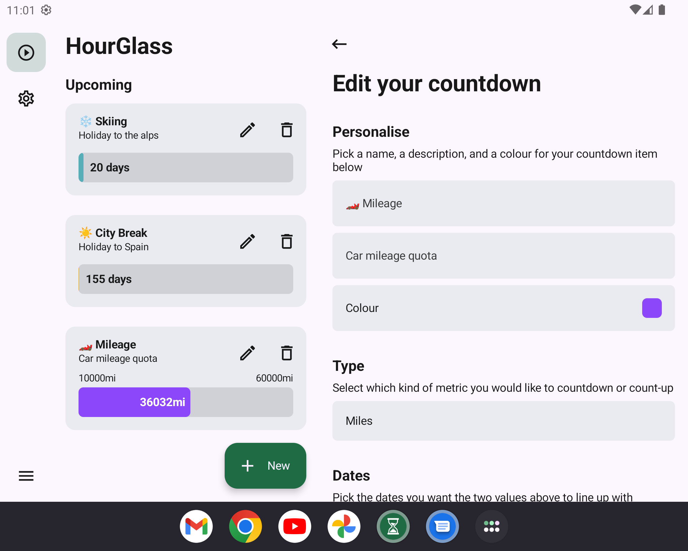

# HourGlass - Android

[](https://github.com/thementalgoose/android-hour-glass/actions)

[](https://play.google.com/store/apps/details?id=tmg.hourglass)


### Screenshots

#### Phone

| 1                                                                   | 2                                                                   | 3                                                                   | 4                                                                   |
|---------------------------------------------------------------------|---------------------------------------------------------------------|---------------------------------------------------------------------|---------------------------------------------------------------------|
|  |  |  |  |

#### Tablet

| 1                                                                    | 2                                                                    | 
|----------------------------------------------------------------------|----------------------------------------------------------------------|
|  |  |

### Play store listing

HourGlass is a small app to be able to track something between two dates so you know what the value should be. You can use this to track how much you should have saved towards a holiday, or how many miles a rental car should be on when you drop it off if you have a quota

HourGlass now supports widget! See the countdown progress right from your home screen

No ads, no purchases required.


```
Copyright 2022 Jordan Fisher

Licensed under the Apache License, Version 2.0 (the "License");
you may not use this file except in compliance with the License.
You may obtain a copy of the License at

    http://www.apache.org/licenses/LICENSE-2.0

Unless required by applicable law or agreed to in writing, software
distributed under the License is distributed on an "AS IS" BASIS,
WITHOUT WARRANTIES OR CONDITIONS OF ANY KIND, either express or implied.
See the License for the specific language governing permissions and
limitations under the License.
```
